# autofix

Heal your failed LLM requests on-the-fly to avoid any downtime. Malformed parameters and model deprecations.

The hosted demo uses `https://phoenix-yc-production.up.railway.app`. Set
`AUTOFIX_API_KEY` in your application environment (or `.env` when your runtime
loads it) to send `Authorization: Bearer <key>` to the heal API. `AUTOFIX_URL`
still overrides the hosted endpoint.



## Installation

### Node / TypeScript

One package - compatible with every LLM SDK.

```bash
npm install @mnfst/autofix
```

#### OpenAI SDK - Chat Completions API

```ts
import OpenAI from 'openai';
import { autofix } from '@mnfst/autofix';

const client = new OpenAI({ fetch: autofix() });

const res = await client.chat.completions.create({
  model: 'gpt-5-mini',
  temperature: 0.2, // gpt-5 models reject this — normally a 400
  messages: [{ role: 'user', content: 'Hello!' }],
});
// → healed at runtime (temperature set to 1), returns a normal 200
```

#### OpenAI SDK - Responses API

```ts
const response = await client.responses.create({
  model: 'gpt-5-mini',
  temperature: 0.2,
  input: 'Hello!',
});
```

#### Anthropic SDK

```ts
import Anthropic from '@anthropic-ai/sdk';
import { autofix } from '@mnfst/autofix';

const client = new Anthropic({ fetch: autofix() });
const message = await client.messages.create({
  model: 'claude-sonnet-4-20250514',
  max_tokens: 256,
  messages: [{ role: 'user', content: 'Hello!' }],
});
```

Other providers like OpenRouter uses the OpenAI SDK with its own `baseURL`:

```ts
import OpenAI from 'openai';
import { autofix } from '@mnfst/autofix/openai';

const client = new OpenAI({
  baseURL: 'https://openrouter.ai/api/v1',
  apiKey: process.env.OPENROUTER_API_KEY,
  fetch: autofix(),
});
```

### Python

One package - compatible with every LLM SDK.

```bash
pip install mnfst-autofix
```

#### OpenAI SDK

```python
from openai import OpenAI
from mnfst_autofix.openai import autofix

client = OpenAI(http_client=autofix())
```

Async:

```python
from openai import AsyncOpenAI
from mnfst_autofix.openai import autofix_async

client = AsyncOpenAI(http_client=autofix_async())
```

#### Anthropic SDK

For Anthropic:

```python
from anthropic import Anthropic
from mnfst_autofix.anthropic import autofix

client = Anthropic(http_client=autofix())
```

#### LiteLLM and other providers

Just change the base_url and add autofix.

```python
from openai import OpenAI
from mnfst_autofix.openai import autofix

client = OpenAI(
    base_url="http://localhost:4000/v1",
    http_client=autofix(),
)
```

## What autofix fixes

Real errors, healed at runtime:

| Normally, you'd see | autofix does |
| --- | --- |
| `Unsupported value: 'temperature' does not support 0.2 with this model.` | sets `temperature` to `1`, replays |
| `Unsupported parameter: 'max_tokens'` | drops `max_tokens`, replays |
| `The model 'gpt-4-0314' has been deprecated` | remaps to the current model (`gpt-5`), replays |

## Never worse than without it

- **Zero overhead on success** — the wrapper only wakes up on a healable failure.
- **Fail open** — autofix is never the outage. A heal API that is slow, down, or wrong gets you your original error back.
- **One replay, ever** — a replay is never itself healed.
- **Your key never leaves** — the provider API key stays on your SDK's request, on its original path. Not a gateway.

## Privacy

The heal API receives settings, not prompt data:

```jsonc
// sent to the heal API
{
  "model": "gpt-5-mini",
  "temperature": 0.2
}

// kept local and restored on replay
{
  "messages": [{ "role": "user", "content": "Hello!" }],
  "tools": [...]
}
```

Scalar settings and scalar-only arrays may travel. Prompts, tools, nested arrays,
schema bodies, identity fields, and credential fields stay local. The provider error,
endpoint origin and path, derived workspace id, and SDK source are also sent.

## See heals

```ts
const client = new OpenAI({
  fetch: autofix({
    onHeal: ({ healStatus, summary }) => {
      console.log(`[autofix] ${healStatus}: ${summary ?? ''}`);
    },
  }),
});
```

## Packages

| Package | Language | SDKs |
|---|---|---|
| [`@mnfst/autofix`](node) | Node / TypeScript | OpenAI, Anthropic |
| [`mnfst-autofix`](python) | Python | OpenAI, Anthropic |

## License

MIT © Manifest
